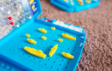

# 

# Battleship
### "Battleship" is simple game written in Python to mimic the classic board game. The inspiration was taken from the sample project ideas from Code Institute.

#### [Here is the live version of my project](https://battleship-cbstange-ca945b7bee2a.herokuapp.com/).

## How to Play:
- Player places their own ships on the board and chooses the orientation of the ships.

- Compuer's board and ship placement are randomly generated and cannot be seen by player.
- Player then guess location of computer's ships by choosing a row between 108 and a column between A-H.

- Player can see a miss marked by a "-" and a hit marked by an "X".
- Computer and player take turns until all ships are sunk.

## Planning:
- Reviewed classic Battleship rules and structure.
- Created a flow chart to help visualize game play logic.

## Data Model:
- For my model, I used a "board" class.
- The "board" class contains:
    - Two board play areas
    - Player and computer board with ships and guesses.

## Current Features:
- Welcome screen with brief description.

- User can play against the computer.
- User is unable to see the computer's board.
- Five ships with four sizes available.
- User is able to choose the location and orientation (horizontal or vertical) of all ships.

- Random ship placement for the computer's board.
- Input validation:
    - User must enter:
        - An "H" or "V" for horizontal or vertical orientation of the ship.
        - A number between 1-8 for the row.
        - A letter between A-H for the column.
    - User cannot enter the same guess twice.
    - User must place ship within the board.
        

## Future Features:
- Score keeper: User's score displayed after each turn.
- User can select board size, ie. difficulty.

## Testing:
- Periodic print() statements were used to verify expected behavior.
- Running program in the terminal to verify expected behavior.
- Debugger tool in Visual Sudio Code was used to verify logic.
- ### Validation:
    - Python code validity check with [Code Institues's Tool](https://pep8ci.herokuapp.com/#).
    - Used [Code Beautify Tool](https://codebeautify.org/python-formatter-beautifier#) to check for and correct indentation issues.
- ### GitHub was used for version control.

## Bugs:
- ### Resolved Bugs:
    - Indentation errors in my try/expect checks.
    - Error for lines longer than 79 characters
- ### Remaining Bugs:
    - I continue to receive error: "E712 comparison to True should be 'if cond is True", however logic still functions as expected.

## Credits:
### Media:
- Images were sourced from [Unsplash](https://unsplash.com/) which is a site that provides free images so there are no copywrite violations.
-  Flowchart was created using [Lucid Chart](https://lucidchart.com/).
### Supporting documents:
- [Battleship Strategies](https://docs.python.org/3/library/random.html) for random logic were used from Python Docs - Python.org.
- YoutTube channel [Code Pointers](https://www.youtube.com/watch?v=PNTvJ4MShlc) was used to resolve line length too long errors.
- YouTube channel [Knowledge Mavens](https://www.youtube.com/watch?v=tF1WRCrd_HQ&t=0s) was used to guide a basic structure for the game.

